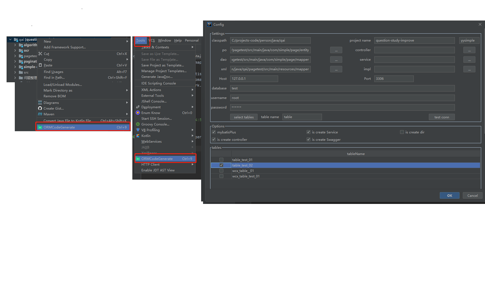
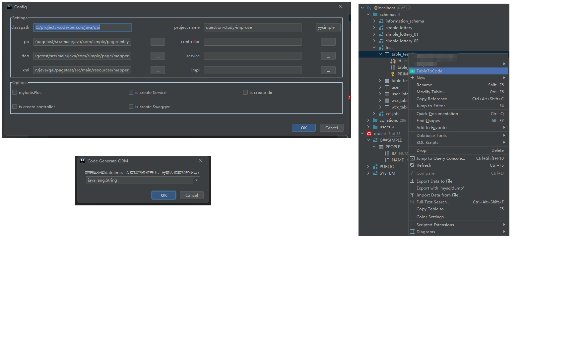

仓库简介：该插件是从个人插件中心孵化出来的，已经可以独立使用了，目前在idea的官方插件市场已经有挺多人在使用；
该插件是用于快速生成ORM层代码的插件，具体的介绍可以参考同级目录下的 “插件简介.md”；

Warehouse introduction: This plugin was incubated from the personal plugin center and can now be used independently. Currently, there are quite a few people using it in the official plugin market of IDEA;
This plugin is used to quickly generate ORM layer code. For specific introduction, please refer to "Introduction to plugins. md" in the same level directory;

个人idea孵化中心项目：https://gitee.com/yysimple/idea-plugins

Personal Idea Incubation Center Project：https://gitee.com/yysimple/idea-plugins

## 简单的用法

### 直接自己连接数据源生成
> 无需在idea的database里面配置，自己配置数据源连接，目前我是把入口放在不同的地方
> 1. 选中项目 -> 右键,最下面 -> ORMCodeGenerate，然后就会出来弹窗让你先配置；（mac用户不适用快捷键推荐）
> 2. Tools -> 最下面；（Windows用户不适用快捷键推荐）
> 3. control + 9，快捷键的方式是我最推荐的；

**下面就是几张操作图：参考代码里面的 “images/插件用法.png”;**

### 直接选择idea的database选中表生成

> 这个就是大多数ORM生成的方式，支持的数据源就是idea支持多少，这里就支持多少，但是这里就是每个项目都需要配置数据源，
> 所以才有了上面那种方式，当然看个人喜好，两种方式都支持了，我是mysql生成的时候比较喜欢用上面那个，我不喜欢在项目
> 里面去连接数据源，我专门开个窗口连所有数据源的（有些人还喜欢用DG，Navicat；纯看个人喜好）

操作也比较简单，但是没提供快捷键：

**操作图片在：“images/table2Orm.png”;**

> 1. 需要选中表，然后右键
> 2. 中间没有找到对应列类型，会询问你需要关联到java的什么类型；
> 3. 最后的弹窗就是上面的阉割版，功能是一样的，就不介绍了；
> 4. 这里有个小问题，你的表中必须要有主键，没有的话，mapper文件、service文件里面的方法不会帮你生成，因为有个方法是 byId的；
>

具体详细的文档参考：“插件简介.md” or “plugin-intro.md”；

